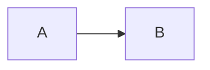

# YADG Product Specification

## Purpose

YADG is a template-first document authoring tool. Markdown and `YADG.md` own maintainable content/data; prepared DOCX templates own structure/presentation; external content producers may transform explicitly declared source representations into YADG-supported content products.

## Authority model

1. Markdown owns semantic document objects and ordinary content.
2. `YADG.md` owns workspace values, notes, and external-producer configuration.
3. DOCX templates own presentation and Word-native structures unless explicitly delegated.
4. External producers supply generated content products but do not own YADG semantics or Word authoring.
5. Generated DOCX/PDF and temporary producer artifacts are derived.
6. Office-independent authoring owns semantic resolution and OOXML transformation.
7. Rendering owns layout-dependent evaluation.

## CLI/artifacts

```text
yadg check [--workspace <path>]
yadg build [--workspace <path>]
yadg render [--workspace <path>] [--renderer libreoffice] [--renderer-path <path>]
```

Templates: `YadgTemplates/*.docx`; authored: `YadgPreWords/*.docx`; finalized: `YadgWords/*.docx`; PDFs: `YadgPdfs/*.pdf`.

M0008 does not add a new public CLI command.

## Markdown

Existing headings/paragraphs/lists/tables/figures/references remain.

M0008 adds inline Mermaid source through fenced blocks:

````markdown

````

The block becomes an ordinary semantic figure backed by an externally generated PNG.

Other code fences remain unsupported in M0008.

## Template vocabulary

Existing template tags/control syntax remain unchanged.

A generated Mermaid figure is placed/referenced through the existing figure semantics and `{{figure:<id>}}`.

## External content producers

M0008 introduces a constrained external process producer boundary, governed by:

```text
docs/specs/CONTENT-PRODUCERS.md
```

The first producer kind is `mermaid`.

Product runtime configuration is command-based and package-manager neutral. Bun/npm/global Mermaid/wrappers are interchangeable if they satisfy the same input/output contract.

Producers cannot mutate DOCX or register arbitrary YADG behavior.

## Workspace front matter

Workspace front matter schema version remains 1.

Root keys may include:

```text
yadg
values
producers
```

Value semantics remain in `docs/specs/WORKSPACE-VALUES.md`; producer semantics are in `docs/specs/CONTENT-PRODUCERS.md`.

## Check/build

`check` remains output-free but executes required configured producers to validate actual source renderability.

`build` performs equivalent validation before modifying normal outputs and embeds producer output through existing semantic authoring.

No stale producer-output fallback is allowed.

## Rendering

Producer execution is an authoring concern.

The renderer receives ordinary authored DOCX containing the generated figure asset and requires no Mermaid-specific logic.

## Diagnostics

External process startup/timeout/exit/output failures are actionable product diagnostics and should include source location and useful captured process detail.

## Non-goals

YADG is not a general plugin host, generic Word layout engine, or generic Markdown-to-DOCX converter.
