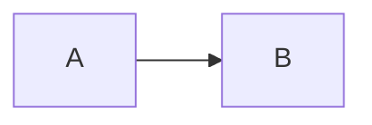

# Milestone — M0008 External Content Producers and Mermaid Diagrams

## Execution Profile

| Field | Value |
|---|---|
| Lifecycle state | ready |
| Mode | ai-executed-human-reviewed |
| Baseline implementation model | GPT-5.6 Luna |
| Baseline executor readiness | confirmed |
| Decision preservation | confirmed |
| Execution tractability | confirmed |
| Scope size | large |
| Implementation autonomy | high |
| Documentation sync | deferred |
| Focused validation | workspace producer config, fenced Mermaid parsing, process runner, failures, semantic figure integration |
| Repository validation | `./eng/validate.ps1` |
| Integration validation | downloaded pinned Bun + Bun one-shot pinned Mermaid CLI + real workspace/DOCX |
| Validation locus/platform | ordinary .NET for Tier 0-2; network-capable supported OS for Tier 3 |
| Consumer/release validation | not applicable |
| Human review | none required |

## Goal

Introduce YADG's first constrained external content producer and make inline Mermaid fenced blocks a natural authoring form.

A Mermaid block is rendered by a configured external command to PNG and then participates as an ordinary semantic YADG figure.

The milestone must establish an extension boundary that can later support other content producers without creating a general in-process plugin framework.

## Target State

- root `YADG.md` schema v1 accepts `producers.mermaid`;
- producer runtime is configured as executable + argument list and is package-manager neutral;
- inline fenced `mermaid` blocks with stable IDs parse as semantic figures;
- optional `caption` integrates with existing figure caption/reference semantics;
- `check` executes the real configured producer and validates output without normal artifacts;
- `build` renders required diagrams before normal output mutation and embeds PNG through existing figure authoring;
- direct/natural figure placement and numeric reference behavior work unchanged;
- producer failures are bounded/actionable and never silently use stale outputs;
- ordinary product operation does not install Bun/npm/Mermaid itself;
- authoritative Tier-3 tests download the Bun version pinned in `eng/test-tools.json`;
- Tier-3 uses Bun one-shot execution of the pinned Mermaid CLI package/version;
- M0007 is reconciled as complete.

## Scope

M0008 covers:

- general external process runner appropriate for content producers;
- workspace `producers` configuration schema;
- built-in `mermaid` producer adapter;
- inline Mermaid fenced-block syntax;
- generated PNG figure product;
- semantic figure ID/caption/natural/direct placement integration;
- reference/caption integration;
- temporary producer input/output lifecycle;
- command/path resolution;
- timeout/startup/exit/output diagnostics;
- no-stale-output behavior;
- exact external test-tool JSON manifest;
- network-capable real integration test using downloaded Bun and Bun package execution;
- direct public documentation updates.

## Non-goals

M0008 does not implement SVG/PDF Mermaid output, arbitrary plugin discovery, arbitrary plugin-defined Markdown syntax, in-process assemblies, external XML/table adapters, source-code formatting, generated values/tables, persistent asset caches, dependency graphs, remote producers, environment maps, shell pipelines, or Mermaid-specific renderer logic.

## Decisions and Constraints

### Plugin/producer model

- A plugin extends where content comes from, not how YADG/Word rendering works.
- M0008 names the constrained capability an external content producer.
- Producer executes out-of-process.
- Producer cannot receive OOXML, mutate DOCX, register arbitrary parser callbacks, or hook lifecycle stages.
- M0008 defines only `mermaid`; future product types require new authority.

### Mermaid authoring

Supported source form:

````markdown

````

- exact lowercase `mermaid`;
- stable ID mandatory;
- optional plain `caption`;
- unknown attributes invalid;
- empty source invalid;
- other code fences remain unsupported.
- Mermaid block is semantically a figure.
- Output is PNG only.
- Existing figure sizing, placement, caption, numbering, bookmark, and REF behavior applies.
- Mermaid source is source authority; generated PNG is derived/ephemeral.

### Workspace producer configuration

Example:

```yaml
producers:
  mermaid:
    executable: bun
    arguments:
      - x
      - --bun
      - --package
      - "@mermaid-js/mermaid-cli@11.17.0"
      - mmdc
```

Product runtime is not tied to Bun.

`npx`, `mmdc`, or wrapper commands are valid alternatives if configured.

YADG executes directly without a shell and appends:

```text
-i <temp-input.mmd> -o <temp-output.png>
```

Configured arguments must not claim Mermaid input/output flags.

A Mermaid block without configured producer is invalid.

### Producer output lifecycle

- one isolated temp invocation per Mermaid block is acceptable M0008 behavior;
- no persistent cache;
- `check` renders but writes no normal artifacts;
- `build` renders before normal output mutation;
- no stale/fallback output;
- output must be valid nonempty PNG with positive dimensions;
- bounded execution and best-effort cleanup.

### External test-tool versions

`eng/test-tools.json` is milestone authority and contains exact pins:

```json
{
  "schemaVersion": 1,
  "bun": {
    "version": "1.4.2"
  },
  "mermaidCli": {
    "package": "@mermaid-js/mermaid-cli",
    "version": "11.17.0"
  }
}
```

Planning selected Bun `1.4.2` as the current latest stable Bun release and Mermaid CLI `11.17.0` as the current latest Mermaid CLI release.

Tests do not dynamically use the string `latest`.

Future upgrades edit this JSON explicitly.

### Authoritative real Mermaid test

Tier-3 must:

1. read `eng/test-tools.json`;
2. download the official Bun release matching `bun.version` for the current supported platform into test-owned local state;
3. verify `bun --version`;
4. invoke Mermaid CLI as one-shot package execution with the configured package/version, logically:

```text
bun x --bun --package @mermaid-js/mermaid-cli@11.17.0 mmdc -i <input> -o <output>
```

5. not require system Node/npm/npx/global mmdc;
6. use the resulting command as the synthetic workspace's `producers.mermaid` command;
7. exercise real `check` and `build`;
8. inspect the actual PNG and authored DOCX.

Failure of the pinned Bun/Mermaid pair blocks Tier-3 completion; do not switch to npm/Node to make the test green.

## Baseline Executor Readiness

Planning has settled:

- plugin responsibility/boundary;
- out-of-process model;
- producer configuration syntax;
- package-manager neutrality;
- Mermaid Markdown syntax;
- semantic figure integration;
- PNG-only output;
- caption/reference behavior;
- process lifecycle/failure rules;
- security/trust boundary;
- no-cache behavior;
- Tier-2/Tier-3 network separation;
- exact Bun/Mermaid version source;
- Bun acquisition and one-shot Mermaid validation target;
- human-review policy.

Implementation owns process-runner types, temp-directory mechanics, exact official Bun archive URL/platform mapping, YAML/internal model representation, diagnostic codes, parser/refactoring details, test-cache mechanics, and work-package decomposition.

No implementation-affecting product decision is intentionally deferred.

## Execution Tractability

Create and maintain:

```text
.execution/M0008-external-content-producers-mermaid.md
```

Map every acceptance criterion to implementation and evidence.

## Required Authority

Read before implementation:

- `docs/SPECS.md`
- `docs/specs/CONTENT-PRODUCERS.md`
- `docs/specs/STRUCTURED-CONTENT.md`
- `docs/specs/WORD-REFERENCES.md`
- `docs/specs/WORKSPACE-VALUES.md`
- `docs/ARCHITECTURE.md`
- `docs/ENGINEERING.md`
- `docs/TERMINOLOGY.md`
- `eng/test-tools.json`

Do not use the external guide repository or planning conversation as implementation authority.

## Acceptance Criteria

### Workspace producer configuration

- schema-v1 `YADG.md` continues to accept existing values-only/no-producer workspaces;
- `producers.mermaid` accepts nonempty `executable` plus optional string `arguments`;
- unknown root/producer keys or unsupported producer kinds fail;
- missing Mermaid configuration fails when Mermaid source exists;
- unused configured Mermaid producer is allowed;
- product does not require Bun/npm specifically.

### Markdown/semantic model

- valid Mermaid fence becomes a semantic figure at its source anchor;
- stable ID is mandatory and joins the existing global semantic namespace;
- duplicate ID with section/table/file figure/other Mermaid figure fails;
- optional caption is plain text;
- unknown attrs and empty Mermaid source fail;
- non-Mermaid fenced code remains unsupported;
- Mermaid source is not emitted as document text.

### Process runner

- executable absolute/relative/PATH resolution works according to authority;
- process is launched without a shell;
- configured args are passed faithfully;
- YADG owns and appends `-i`/`-o`;
- configured input/output flags are rejected;
- temp `.mmd` and `.png` are isolated per invocation;
- timeout/start failure/nonzero exit are diagnosed;
- useful stderr is surfaced safely;
- missing/empty/non-PNG/undecodable output fails;
- temporary resources clean on success and best-effort on failure;
- stale prior generated output is never accepted.

### Check/build

- `check` actually invokes the configured Mermaid producer and validates PNG, but creates no normal artifacts;
- `build` performs equivalent producer validation before modifying normal outputs;
- invalid Mermaid source/producer failure preserves pre-existing `YadgPreWords` outputs;
- successful build embeds generated PNG through ordinary figure authoring;
- no persistent generated-image directory/cache is required/created by contract.

### Figure integration

- natural placement works inside content/section selection;
- `{{figure:<mermaid-id>}}` relocation works and suppresses natural emission;
- generated figure uses existing intrinsic-size/fit behavior;
- optional caption follows existing template-owned caption behavior;
- captioned uniquely rendered Mermaid figure can be targeted by `[@id]`;
- uncaptioned Mermaid figure is not a numeric target;
- existing file-backed figures remain unchanged.

### Runtime neutrality/security

- workspace may configure Bun, npm/npx, global mmdc, or wrapper command;
- ordinary product operation never downloads/installs Bun or Mermaid automatically;
- producer config is documented as trusted executable configuration;
- no OOXML/plugin lifecycle API is exposed.

### Test-tool manifest

- `eng/test-tools.json` is parsed/validated by test infrastructure;
- Bun/Mermaid package versions come from this file rather than duplicated literals in test code;
- JSON contains exact versions;
- Tier 0-2 do not require network download merely because the manifest exists.

### Tier-3 real Bun/Mermaid target

- test obtains exact configured official Bun release without global installation;
- downloaded Bun version is verified against manifest;
- Mermaid CLI package/version comes from manifest;
- execution uses downloaded Bun one-shot package execution with `--bun`;
- test does not depend on installed Node/npm/npx/mmdc;
- simple real Mermaid diagram renders to valid PNG;
- actual YADG `check` succeeds using this command;
- actual YADG `build` produces DOCX containing generated image;
- representative caption/reference/direct-or-natural placement is structurally verified;
- runtime evidence records OS/platform, Bun version, Mermaid CLI version/package, and relevant command result.

### Compatibility/documentation

- `./eng/validate.ps1` remains ordinary portable repository validation without mandatory real external download;
- existing M0002-M0007 suite remains green;
- README/direct docs show Mermaid fence and package-manager-neutral producer examples;
- fixtures are synthetic/non-confidential;
- execution ledger maps every criterion to evidence.

## Validation

### Tier 0 — edit sanity

Build/static checks for changed .NET/projects/config JSON.

Validate `eng/test-tools.json` structure.

### Tier 1 — focused validation

Use deterministic local process fixtures/fake producers where useful to cover:

- YAML producer schema;
- fence parsing;
- IDs/attrs/source diagnostics;
- command resolution/argument ownership;
- timeout/nonzero/start failures;
- stderr diagnostics;
- invalid PNG output;
- no-stale-output behavior;
- semantic figure placement/caption/reference integration.

These tests are not real Mermaid compatibility evidence.

### Tier 2 — repository validation

```powershell
./eng/validate.ps1
```

Must not require Bun/npm/Node/Mermaid download or LibreOffice.

### Tier 3 — real external producer integration

Network-capable locus required.

Read versions from:

```text
eng/test-tools.json
```

Download exact official Bun release, verify it, then use one-shot package execution of exact Mermaid package/version with `--bun`.

A representative direct low-level probe is acceptable before the full YADG scenario:

```text
<downloaded-bun> x --bun --package @mermaid-js/mermaid-cli@<version> mmdc -i input.mmd -o output.png
```

Then create a synthetic YADG workspace whose `YADG.md` config points at that downloaded Bun executable and corresponding argument prefix.

Run:

```powershell
dotnet run --project src/Yadg.Cli/Yadg.Cli.csproj -- check --workspace <workspace>
dotnet run --project src/Yadg.Cli/Yadg.Cli.csproj -- build --workspace <workspace>
```

Scenario must include at least:

- inline Mermaid fenced block with stable ID and caption;
- valid Mermaid flowchart;
- surrounding section content;
- a figure placement path;
- numeric reference where existing template caption prerequisites are configured;
- real DOCX template.

Evidence must prove:

- real Mermaid process success;
- valid generated PNG/signature/dimensions;
- no generated PNG persisted as source authority;
- generated image part and drawing in authored DOCX;
- caption/reference field/bookmark structures where applicable;
- no Mermaid source fence text in output;
- ordinary existing content still authors correctly.

Tier-3 completion is blocked if real Bun/Mermaid execution cannot be demonstrated.

### Tier 4 — consumer/release validation

Not applicable.

### Tier 5 — human review

Not required.

M0008 claims functional producer execution and structural semantic/Word integration, not subjective diagram styling quality.

## Constrained Runtime

Tier 0-2 remain bounded/offline-capable under existing repository expectations.

Tier 3 is explicitly network-capable because it downloads Bun and one-shot Mermaid package/browser dependencies.

No credentials are required.

## Research

No durable `docs/research/` artifact is required.

Planning used current external version evidence only to select exact pins. The authoritative implementation inputs are promoted into `eng/test-tools.json` and project/milestone authority.

## Documentation Impact

Planning adds/updates:

- `eng/test-tools.json`
- `docs/specs/CONTENT-PRODUCERS.md`
- `docs/specs/WORKSPACE-VALUES.md`
- `docs/SPECS.md`
- `docs/ARCHITECTURE.md`
- `docs/ENGINEERING.md`
- `docs/TERMINOLOGY.md`
- `docs/MILESTONES.md`
- this milestone

It reconciles M0007 as complete.

Implementation updates README/direct usage documentation.

No `.guide-sync/pending/` hint is required.

## Human Review

Applicability: none.

No review request is created.

## Completion Expectations

Implementation owns:

```text
execution decomposition
-> persistent execution ledger
-> implement bounded work packages
-> Tier 0-2 validation
-> mandatory real Bun/Mermaid Tier-3 validation
-> fresh milestone/authority reread
-> milestone <-> ledger <-> repository/evidence reconciliation
-> completion audit
```

Passing portable tests without Tier-3 does not complete M0008.

## Baseline-Executability Audit

Planning confirms:

- applicable profile/guide version;
- M0007 completion;
- producer scope and trust boundary;
- workspace schema;
- command model/package-manager neutrality;
- Markdown syntax;
- generated semantic figure behavior;
- PNG-only contract;
- failure/output lifecycle;
- test version pins;
- real Bun download/one-shot Mermaid target;
- validation loci;
- human-review policy.

Remaining choices are implementation mechanics.

M0008 is ready for GPT-5.6 Luna.

## Escalation Boundary

Return to planning for material changes to:

- producer responsibility or in/out-of-process boundary;
- arbitrary plugin lifecycle/parser API;
- workspace producer schema;
- command/package-manager neutrality;
- Mermaid fence syntax;
- product output type beyond PNG figure;
- semantic figure/placement/caption/reference behavior;
- persistent caching;
- product-managed package installation;
- test-version authority;
- Bun one-shot Tier-3 requirement;
- validation/human-review policy.

Implementation owns local process/temp/parser/test-download mechanics consistent with this contract.
