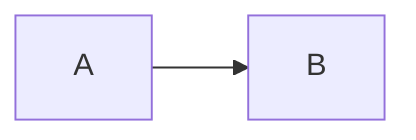

# External Content Producers Specification

## Status

Authoritative for external content producers and inline Mermaid diagrams introduced by M0008.

## Purpose

Some maintainable document content is more naturally authored in a source representation other than ordinary Markdown text.

M0008 introduces a constrained external-content-producer boundary:

> an external producer converts explicitly declared source content into a YADG-supported content product; YADG remains responsible for semantic identity, placement, Word authoring, references, validation, and rendering.

M0008 proves this boundary with inline Mermaid diagrams producing PNG figure assets.

This is not a general in-process plugin API.

## Architectural boundary

External producers:

- execute outside the YADG process;
- receive only the source/input required by their adapter;
- produce a declared artifact;
- do not receive OOXML objects;
- do not mutate DOCX templates;
- do not register arbitrary Markdown parsers;
- do not hook arbitrary YADG lifecycle events;
- do not replace YADG placement/reference/rendering semantics.

M0008 defines one producer kind: `mermaid`.

Future producer kinds may reuse the process runner but require their own source/product contracts.

## Workspace configuration

Producer configuration lives in root `YADG.md` front matter because it defines workspace authoring behavior rather than Word presentation.

M0008 extends workspace front matter with optional root key:

```yaml
producers:
  mermaid:
    executable: bun
    arguments:
      - x
      - --bun
      - --package
      - "@mermaid-js/mermaid-cli@11.17.0"
      - mmdc
```

The exact executable is intentionally not tied to npm, Bun, Node, or a global Mermaid installation.

Equivalent examples include:

```yaml
producers:
  mermaid:
    executable: npx
    arguments:
      - -p
      - "@mermaid-js/mermaid-cli@11.17.0"
      - mmdc
```

or:

```yaml
producers:
  mermaid:
    executable: mmdc
    arguments: []
```

### Producer schema

`producers` is optional.

In M0008 the only supported producer key is:

```text
mermaid
```

Its mapping contains exactly:

```text
executable
arguments
```

`executable` is a non-empty string.

`arguments` is optional and, when present, is a YAML sequence of string scalars.

Unknown producer kinds or unknown keys are errors.

A configured but unused producer is allowed.

A Mermaid block without a configured Mermaid producer is a `check` error.

## Command resolution

YADG executes the configured producer directly; it does not invoke a shell.

`executable` may be:

- an absolute executable path;
- a relative executable path, resolved relative to the workspace root;
- a bare executable name resolved through the process `PATH`.

The argument list is passed without shell interpolation.

The external producer executes with the workspace root as working directory unless implementation requires an isolated temporary working directory while preserving equivalent relative-path behavior.

M0008 defines no producer-specific environment-variable configuration.

## Mermaid command contract

For each Mermaid block, YADG creates an isolated temporary producer invocation containing:

- one UTF-8 Mermaid source file;
- one expected `.png` output path.

YADG invokes:

```text
<executable> <configured arguments...> -i <input.mmd> -o <output.png>
```

The configured argument list must not attempt to own the Mermaid CLI input/output parameters `-i`, `--input`, `-o`, or `--output`; those are reserved by YADG.

Other Mermaid CLI options in configured arguments are permitted.

The command must complete within a bounded wait. Exact timeout value is implementation-owned.

A non-zero exit code, timeout, startup failure, or missing/invalid output is a producer failure with actionable diagnostics including captured stderr where practical.

Temporary producer resources are removed on success and best-effort on failure.

## Output product

M0008 Mermaid output is PNG only.

The generated PNG is a derived ephemeral authoring artifact, not workspace source authority.

YADG validates the output as a non-empty decodable PNG with positive pixel dimensions and then treats it through the existing figure authoring path.

No persistent generated-image cache is defined in M0008.

`check` may create temporary producer outputs for validation but does not create normal workspace artifacts.

`build` renders required producer outputs before normal output modification and must not silently reuse stale output from a previous invocation.

## Markdown syntax

M0008 adds one supported fenced block form.

Example:

````markdown

````

The fence info string grammar is:

```text
mermaid {#<stable-id>}
mermaid {#<stable-id> caption="<plain-text-caption>"}
```

Rules:

- the language token is exactly lowercase `mermaid`;
- stable ID is mandatory;
- stable ID uses the existing semantic object lexical form `[A-Za-z][A-Za-z0-9_-]*`;
- `caption` is optional;
- caption is plain semantic text, not Markdown;
- unknown attributes are errors;
- empty Mermaid source is an error;
- other fenced code blocks remain unsupported in M0008.

The exact Markdown fence delimiter/length follows the existing Markdown parser's fenced-code-block support; M0008 semantics are determined by the info string above.

## Semantic integration

A Mermaid block is a semantic figure.

Its stable ID participates in the existing semantic object namespace and therefore conflicts with any section/table/figure using the same stable ID.

Its source position is its natural figure anchor.

It participates in existing figure behavior:

- `{{content:<section-id>}}` and `{{section:<section-id>}}` include it at its natural anchor unless relocated;
- `{{figure:<id>}}` may directly place it;
- direct placement suppresses natural-anchor emission under existing placement rules;
- figure sizing uses the generated PNG's intrinsic pixel size and the existing authored-width rules;
- optional caption uses the existing figure-caption behavior;
- a captioned uniquely rendered Mermaid figure may be referenced by `[@id]` under existing M0004 requirements;
- an uncaptioned Mermaid figure is not a numeric reference target.

The Mermaid source itself is not written as document text.

## Check/build behavior

`check` validates:

- workspace producer configuration;
- Mermaid fenced-block syntax/attributes/IDs;
- semantic global-ID uniqueness;
- producer executable resolution/startup;
- successful actual Mermaid rendering to valid PNG;
- all ordinary template/placement/reference prerequisites for the resulting semantic figure.

`check` creates no normal output artifacts.

`build` performs equivalent validation before modifying normal authored outputs.

For a valid build, generated PNG bytes are embedded through the normal Word figure path.

Producer failure must not leave a partial normal authored output presented as successful.

## Process trust boundary

Producer configuration is executable-code configuration.

Running `yadg check` or `yadg build` on a workspace containing producer configuration may execute the configured external program.

M0008 provides process separation but no sandbox and no network isolation.

Users must treat producer configuration with the same trust as other executable project tooling.

YADG itself does not fetch Mermaid CLI or install package managers during ordinary product operation.

Whether a configured command accesses the network is outside the M0008 product contract.

## Runtime/package-manager neutrality

The product contract is intentionally package-manager neutral.

YADG does not inspect whether Mermaid is reached through:

- Bun / `bun x`;
- npm / `npx`;
- a global `mmdc`;
- another wrapper command.

Correctness is defined by the configured command satisfying the Mermaid input/output contract.

The repository integration test uses Bun as the authoritative real test path, but that does not make Bun part of the product runtime contract.

## Test-tool versions

Repository external-tool test versions are configured in:

```text
eng/test-tools.json
```

M0008 schema:

```json
{
  "schemaVersion": 1,
  "bun": {
    "version": "..."
  },
  "mermaidCli": {
    "package": "@mermaid-js/mermaid-cli",
    "version": "..."
  }
}
```

The file contains exact versions, not floating `latest` selectors.

Planning sets the Bun pin to the current latest stable release and the Mermaid CLI pin to the current latest release at milestone creation.

Changing test versions later is an explicit change to this JSON file.

## Deferred behavior

M0008 does not define:

- SVG/PDF producer output;
- arbitrary external asset blocks;
- external XML/table adapters;
- code-formatting producers;
- producer-generated workspace values;
- producer-generated semantic tables;
- arbitrary plugin-defined Markdown syntax;
- in-process .NET plugin loading;
- producer discovery/registration;
- persistent generated-asset caches;
- producer dependency graphs;
- remote producer services;
- producer environment-variable maps;
- shell-command strings/pipelines;
- rendering Mermaid directly inside Word/LibreOffice.
