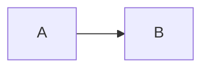

# Authoring

This guide describes the source side of a YADG workspace. Template-specific presentation is covered in [Templates](TEMPLATES.md).

## Workspace structure

A typical workspace is:

```text
MyReport/
├── YADG.md
├── content.md
├── chapters/
│   └── architecture.md
├── images/
│   └── system-context.png
└── YadgTemplates/
    └── report.docx
```

`YADG.md` marks the workspace root.

YADG discovers Markdown sources recursively while pruning dot directories and the conventional YADG directories:

```text
YadgTemplates
YadgPreWords
YadgWords
YadgPdfs
```

Linked child directories are not recursively followed. Ordinary file links and explicitly selected workspace/conventional directories use normal OS file access.

Use:

```powershell
yadg check --list
```

to see the discovered source/template/reference inventory.

## Stable IDs

Stable IDs identify semantic objects across source and template placement.

Heading:

```markdown
# Introduction {#introduction}
```

Table:

```markdown
| Name | Value |
|---|---|
| A | 1 |
{#values}
```

Figure:

```markdown
{#system-context}
```

IDs are workspace-wide. Duplicate/ambiguous IDs are errors, including under YOLO.

## Sections and content placement

Given:

```markdown
# Architecture {#architecture}

Introductory text.

## Assumptions

Details.
```

A template may use:

```text
{{section:architecture}}
```

to insert the selected heading plus body, or:

```text
{{content:architecture}}
```

to insert only the body.

Heading levels are composed relative to the prepared template context. The template owns final heading styles/numbering.

## Paragraphs and inline content

YADG supports ordinary paragraph text plus the supported Markdown inline subset, including emphasis and strong emphasis.

Semantic numeric references use:

```markdown
See Section [@architecture].
```

The `[@architecture]` syntax emits only the numeric Word result when a truthful numeric target exists. The surrounding source owns words such as “Section”, “Figure”, or “Table”.

## Lists

Flat lists are supported.

Unordered:

```markdown
- First
- Second with **emphasis**
```

Ordered:

```markdown
1. First
2. Second
```

Nested lists, task lists, block content in list items, and multi-paragraph list items are not supported.

List presentation is template-owned through real list styles/numbering or list-item prototypes.

## Tables

Pipe tables require stable IDs:

```markdown
| System | Protocol |
|---|---|
| Alpha | HTTPS |
| Beta | SFTP |
{#interfaces}
```

Supported cell content is the documented inline subset.

Templates can either let YADG generate the table or provide a prepared table-row prototype. See [Templates](TEMPLATES.md).

## Figures

Figures are block Markdown images with stable IDs:

```markdown
{#system-context}
```

Supported image formats:

```text
PNG
JPEG/JPG
```

The image target is relative to the source Markdown file.

It must resolve lexically inside the workspace. A path such as:

```text
../../outside.png
```

is invalid.

Remote URLs and data URIs are unsupported.

YADG treats the selected local workspace as trusted input. A file link is usable when ordinary OS file access can read it; YADG does not resolve the final symlink target to create a hostile-filesystem sandbox.

## Captions and references

Figure alt text is semantic caption text.

Tables can have optional caption metadata according to the structured-content contract.

Numeric figure/table references require the corresponding template caption prototype/numbering mechanics. If the template cannot truthfully establish numeric semantics, strict mode errors rather than inventing a number.

## Workspace values

`YADG.md` can define single-line scalar values:

```yaml
---
yadg:
  version: 1

values:
  document-version: "1.1"
  environment: "Production"
---
```

Use:

```text
{{value:document-version}}
```

in supported visible DOCX template text. Workspace values are template-text substitution; they are not a Markdown-source interpolation feature.

Missing values are errors in strict mode. YOLO preserves the unresolved token visibly rather than inventing content.

## Markdown policy

The workspace schema remains version 1.

Configure optional unsupported-construct handling:

```yaml
---
yadg:
  version: 1

markdown:
  thematicBreak: ignore
  codeInline: style
---
```

### `thematicBreak`

Accepted values:

```text
error
ignore
```

Default:

```text
error
```

`ignore` emits nothing for the thematic break.

### `codeInline`

Accepted values:

```text
error
ignore
style
```

Default:

```text
error
```

`ignore` preserves code text as ordinary text.

`style` requires a template `codeInline` character-style role when selected content actually contains inline code.

Under YOLO, a missing configured inline-code presentation may resolve to a compatible code/source/monospace character style or ordinary text.

Ordinary fenced code blocks are unsupported except for Mermaid.

## Mermaid producer

Configure one trusted external command:

```yaml
producers:
  mermaid:
    executable: mmdc
    arguments: []
```

Or use an explicit package-manager invocation, for example:

```yaml
producers:
  mermaid:
    executable: bun
    arguments:
      - x
      - --bun
      - --package
      - "@mermaid-js/mermaid-cli@11.17.0"
      - mmdc
```

YADG owns the Mermaid input/output arguments. Configured arguments must not take over `-i/--input` or `-o/--output`.

Source:

````markdown

````

A Mermaid block is a semantic figure.

`check` and `build` may execute the producer. The producer runs with the user's permissions; YADG provides process separation, not a security sandbox.

Under YOLO, a failed producer can become an obvious visible placeholder figure. YADG does not silently remove it or substitute an unconfigured executable.

## Publication configuration

Optional:

```yaml
publish:
  path: ./Published
```

CLI `--publish-path` overrides this value.

`publish` is downstream-only: it copies current finalized `YadgWords/*.docx` and does not parse Markdown, inspect templates, validate figures, or execute producers.

## Diagnostics

Markdown/YAML diagnostics use workspace-relative paths and line/column where available.

DOCX diagnostics use human-recognizable context where possible:

```text
YadgTemplates/report.docx
body > "Risk Model" > paragraph 16
near: "Missing values are treated as..."
```

Use:

```powershell
yadg inspect template
```

when you need to understand a Word-side location/resource.

## Generated artifacts

Successful build owns the complete current:

```text
YadgPreWords/*.docx
```

Successful render owns the complete current finalized result set:

```text
YadgWords/*.docx
YadgPdfs/*.pdf   # when actual renderer is LibreOffice
```

A successful Word render removes stale LibreOffice PDFs.

Keep unrelated persistent files outside these generated directories.

## Strict and YOLO

Strict mode is the production correctness contract.

YOLO is invocation-local:

```powershell
yadg check --yolo
yadg build --yolo
yadg render --yolo
```

Each recovery is reported as a degradation.

YOLO may reduce presentation fidelity or runtime choice. It may not invent semantic identity, bypass lexical workspace asset rules, misstate the actual renderer, or claim an operation succeeded when it did not.
