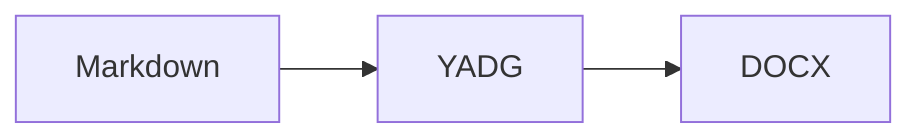

# Getting started

YADG turns source-controlled Markdown into prepared Word documents while keeping presentation in DOCX templates.

The ownership model is:

```text
Markdown        -> maintainable semantic content
YADG.md         -> workspace values/policies/producers/publication config
DOCX template   -> layout, styles, numbering, fields, Word-native structure
YADG            -> authoring, validation, finalization orchestration
```

## Requirements

Install YADG 1.1.0 as a .NET tool:

```powershell
dotnet tool install --global Yadg --version 1.1.0
yadg --version
```

The authoritative full-product target is Windows x64.

Microsoft Word rendering requires activated desktop Word in an interactive logged-on Windows session. LibreOffice rendering requires Writer. Mermaid diagrams require a separately configured trusted producer.

## 1. Create a workspace

```powershell
mkdir MyReport
cd MyReport
yadg init
```

The command creates:

```text
YADG.md
content.md
YadgTemplates/
```

It never overwrites those owned starter paths.

## 2. Add a prepared DOCX

Create or copy a Word document into:

```text
YadgTemplates/report.docx
```

Put this visible text where the starter introduction body should appear:

```text
{{content:introduction}}
```

YADG uses visible text tags; you do not need Word content controls.

## 3. Author Markdown

A useful `content.md` might be:

```markdown
# Introduction {#introduction}

This document describes the system.

## Architecture {#architecture}

The workflow is:

1. Author Markdown.
2. Build DOCX.
3. Finalize through Word or LibreOffice.

See Section [@introduction].
```

Stable IDs use:

```text
{#id}
```

Semantic numeric references use:

```text
[@id]
```

`{{section:id}}` in a template inserts the selected heading and body. `{{content:id}}` inserts only the body.

## 4. Check the workspace

```powershell
yadg check --list
```

`check` validates without producing normal generated documents.

`--list` also shows discovered Markdown sources, DOCX templates, and referenceable semantic objects.

Fix strict errors before production output.

## 5. Inspect the template

When you need to know what Word actually stored:

```powershell
yadg inspect styles
```

When you need to know what YADG will use:

```powershell
yadg inspect template
```

The latter explains presentation roles, prototypes, style/resource resolution, searchable Word locations, and possible YOLO fallbacks.

## 6. Build

```powershell
yadg build
```

Authored intermediate DOCX files are written to:

```text
YadgPreWords/
```

This is a YADG-generated result set.

## 7. Render/finalize

With Microsoft Word:

```powershell
yadg render --renderer word
```

With LibreOffice:

```powershell
yadg render --renderer libreoffice
```

LibreOffice is the default renderer.

Finalized DOCX files go to:

```text
YadgWords/
```

LibreOffice also produces:

```text
YadgPdfs/
```

Successful rendering replaces the complete current generated result set. Do not store unrelated persistent files in these directories.

## 8. Publish

Publish finalized DOCX to a filesystem directory:

```powershell
yadg publish --publish-path ./Published
```

Or configure:

```yaml
publish:
  path: ./Published
```

and run:

```powershell
yadg publish
```

Publishing does not build/render and does not reload authoring content or run Mermaid. It copies current top-level finalized `YadgWords/*.docx`.

## Add values

In `YADG.md`:

```yaml
---
yadg:
  version: 1
values:
  document-version: "1.1"
---
```

Use:

```text
{{value:document-version}}
```

in supported visible DOCX template text, for example:

```text
Document version: {{value:document-version}}
```

Workspace values are not Markdown-source interpolation.

## Add a figure

```markdown
{#system-context}
```

Figures currently support PNG and JPEG/JPG.

The path is relative to the Markdown source and must remain lexically inside the workspace.

## Add a table

```markdown
| Component | Purpose |
|---|---|
| YADG | Authors DOCX |
| Word | Finalizes fields |
{#component-table}
```

Tables require stable IDs.

## Add Mermaid

Configure a trusted producer in `YADG.md`:

```yaml
producers:
  mermaid:
    executable: mmdc
    arguments: []
```

Then:

````markdown

````

YADG executes the configured external command with your user permissions. Review producer configuration before running a workspace.

## Strict versus YOLO

Normal commands are strict:

```powershell
yadg check
yadg build
yadg render --renderer word
```

Strict answers whether the requested operation is production-correct.

During authoring you can explicitly request best effort:

```powershell
yadg check --yolo
yadg build --yolo
yadg render --renderer word --yolo
```

YOLO never hides a recovery. It prints a `degradation` showing the problem and selected fallback.

Examples of defined best-effort behavior include:

- choose a compatible template presentation resource;
- use built-in real Word list numbering;
- preserve inline code as plain text;
- preserve an unresolved value/reference visibly;
- insert an obvious placeholder for a missing figure or failed Mermaid producer;
- substitute the alternate renderer.

If Word is unavailable and LibreOffice succeeds, `render --renderer word --yolo` may complete through LibreOffice and reports that actual renderer.

YOLO still refuses semantic ambiguity, malformed required configuration, lexical asset escape, corrupt DOCX handling, no useful output, or both renderers failing.

Use strict mode for production/CI gates.

## Next

- [Authoring](AUTHORING.md) — Markdown, IDs, values, producers and workspace behavior
- [Templates](TEMPLATES.md) — placements, styles, prototypes and presentation
- [Troubleshooting](TROUBLESHOOTING.md) — diagnostics and YOLO recovery
